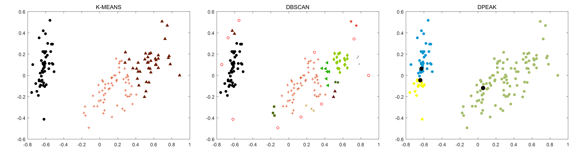
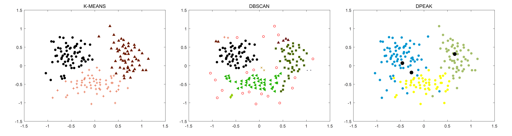
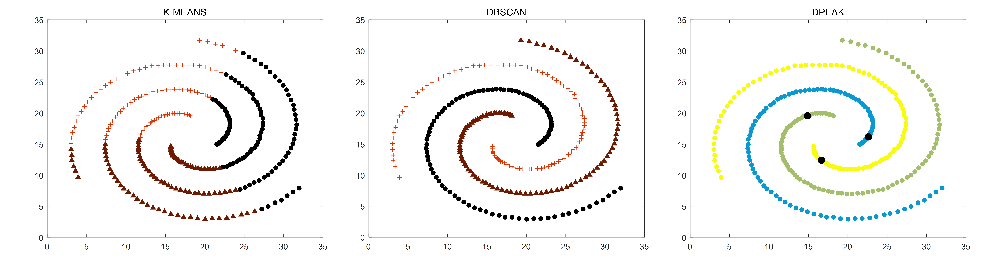

# Clustering

> 三种聚类算法的比较，在不同数据分布的数据集上测试这三个算法。


## Dataset Download

Click [this](https://pan.baidu.com/s/1UNRLugkOKTIfHOzgdH1VEQ) to get the dataset.


## Description

该项目包含3个聚类算法，分别是K-Means, DBSCAN, DPeak算法，其中datasets文件包含了6个数据集，它们的散点图对应如下：


## Results

```matlab
>>kmeans('datasets/1/', 7, 0.01)
>>dbscan('datasets/1/', 4, 6)
>>dpeak_auto('datasets/1/', 4, 'gaussian',7)
```


```matlab
>>kmeans('datasets/2/', 5, 0.01)
>>dbscan('datasets/2/', 10, 3)
>>dpeak_auto('datasets/2/', 3, 'gaussian',5)
```


```matlab
>>kmeans('datasets/3/', 5, 0.0275)
>>dbscan('datasets/3/', 8, 0.023)
>>dpeak_auto('datasets/3/', 4, 'gaussian',5)
```


```matlab
>>kmeans('datasets/iris/', 3, 0.01)
>>dbscan('datasets/iris/', 1, 0.078)
>>dpeak_auto('datasets/iris/', 4, 'gaussian',3)
```



```matlab
>>kmeans('datasets/wine/', 3, 0.01)
>>dbscan('datasets/wine/', 1, 0.13)
>>dpeak_auto('datasets/wine/', 5.64, 'gaussian',3)
```



```matlab
>>kmeans('datasets/spiral/', 3, 0.05)
>>dbscan('datasets/spiral/', 15, 3.5689)
>>dpeak_manual('datasets/spiral/', 5.64, 'gaussian')
```



